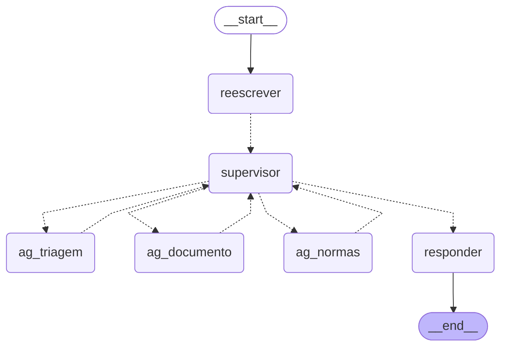

# Grafo do agente

Gerado por `python -m scripts.desenhar_grafo` (`get_graph().draw_mermaid()` do LangGraph).

```mermaid
---
config:
  flowchart:
    curve: linear
---
graph TD;
	__start__([<p>__start__</p>]):::first
	reescrever(reescrever)
	supervisor(supervisor)
	ag_triagem(ag_triagem)
	ag_documento(ag_documento)
	ag_normas(ag_normas)
	responder(responder)
	__end__([<p>__end__</p>]):::last
	__start__ --> reescrever;
	ag_documento -.-> supervisor;
	ag_normas -.-> supervisor;
	ag_triagem -.-> supervisor;
	reescrever -.-> supervisor;
	supervisor -.-> ag_documento;
	supervisor -.-> ag_normas;
	supervisor -.-> ag_triagem;
	supervisor -.-> responder;
	responder --> __end__;
	classDef default fill:#f2f0ff,line-height:1.2
	classDef first fill-opacity:0
	classDef last fill:#bfb6fc
```
